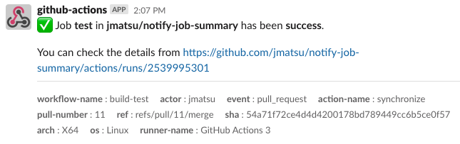
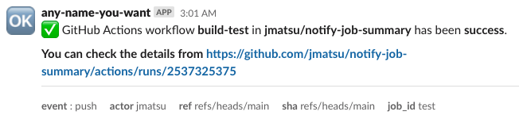

# notify-job-summary

This GitHub Action notifies the job summary to Slack via the incoming webhook. 



> If you would like to get the notification for the workflow rather than jobs, `workflow_run` event is what you want.

# Usage

You can get alerts and/or intermediate reports from GitHub Actions by using this action. Basically, you need to combine `if` expression and the step position where defines this action. 

For example, you can get notifications if a previous step fails and the job becomes `failure` in conclusion.

```yml
on:
  pull_request:

jobs:
  build:
    steps:
      - uses: actions/checkout@v3
      - uses: actions/setup-java@v3
      - run: ./gradlew build
      - uses: jmatsu/notify-job-summary@v1
        if: >
          failure()
        with:
          webhook-url: ${{ secrets.SLACK_WEBHOOK_URL }}
# EOF
```

This action will let you know the progress of the job if you insert this action into the middle of the steps. Please refer to https://docs.github.com/en/actions/learn-github-actions/expressions#status-check-functions for the status function.

## Customization

You can customize the message icon, the username and the channel. Please check [action.yml](./action.yml) for the inputs and/or outputs.



### Additional content

`content-template` and `content-template-path` inputs allow adding the flexible markdown content to the notification. 

```yml
- uses: jmatsu/notify-job-summary@v1
  if: >
    failure()
  with:
    webhook-url: ${{ secrets.SLACK_WEBHOOK_URL }}
    content-template: |
      Hello world. You can embed the variables by <%= "here would be evaliated" %>.
```

The template engine is https://github.com/mde/ejs. Please check the latest options in [./src/template.ts](./src/template.ts) and [./src/payload.ts](./src/payload.ts).

- `<%= content to be evaluated %>`
  - The output is a html-escaped content. Use `<%- %>` if you don't wanna escape the value.
- Available custom variables
  - [githubOption: GitHubOption](./src/github.ts)
  - [jobOption: JobOption](./src/job.ts)
  - [slackOption: SlackOption](./src/slack.ts)

# Instructions

- 1. Create an incoming webhook.
  - https://api.slack.com/messaging/webhooks
- 2. Configure this action in your workflows.
- 3. That's it.

*Please ask Slack team about how to create webhooks and/or which parameters are customizable by spec.*

# Development & Contributions

Contributions are welcome!

- Modify `src/**.ts` or other sources
- Run `npm run all`
  - Make sure all tests pass and add new test cases if needed
  - Fix lint issues
- Confirm `dist/` has been changed if you change typescript files

Feature requests are also welcome of course. Please feel free to open an issue if you have any question and/or you have any idea for the improvements.

## License

This action is under MIT License.

> This action is created from the template of https://github.com/actions/typescript-action.
